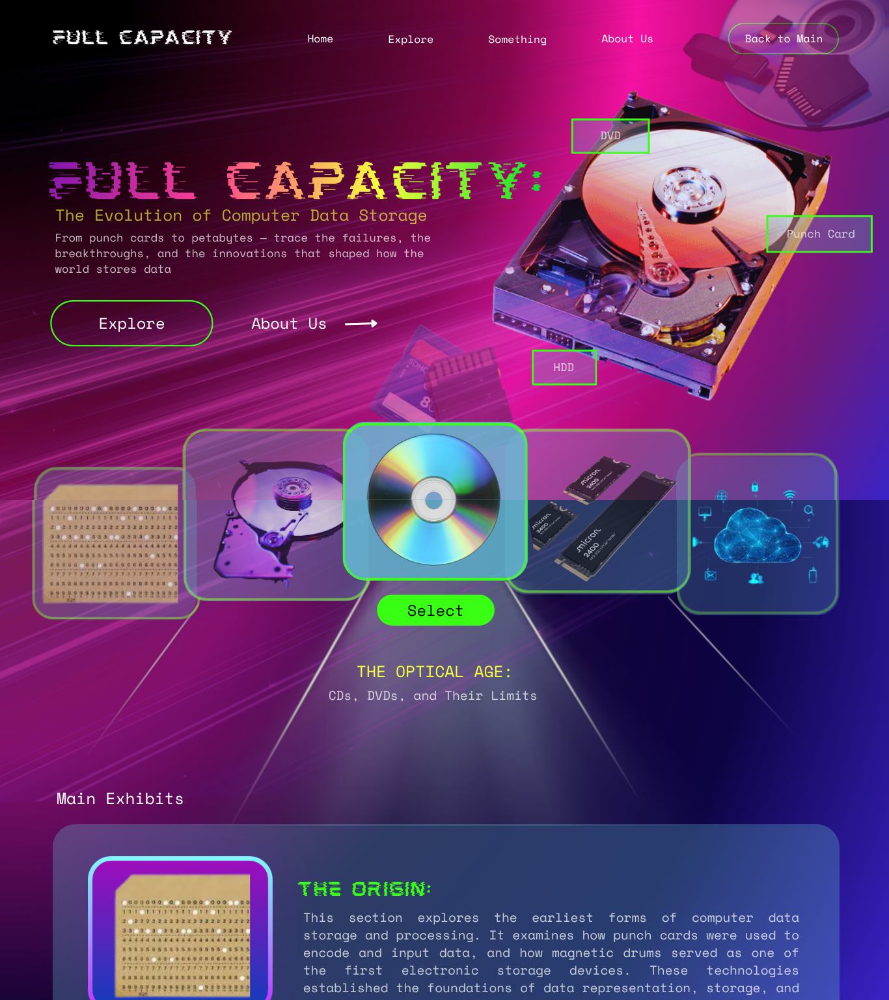
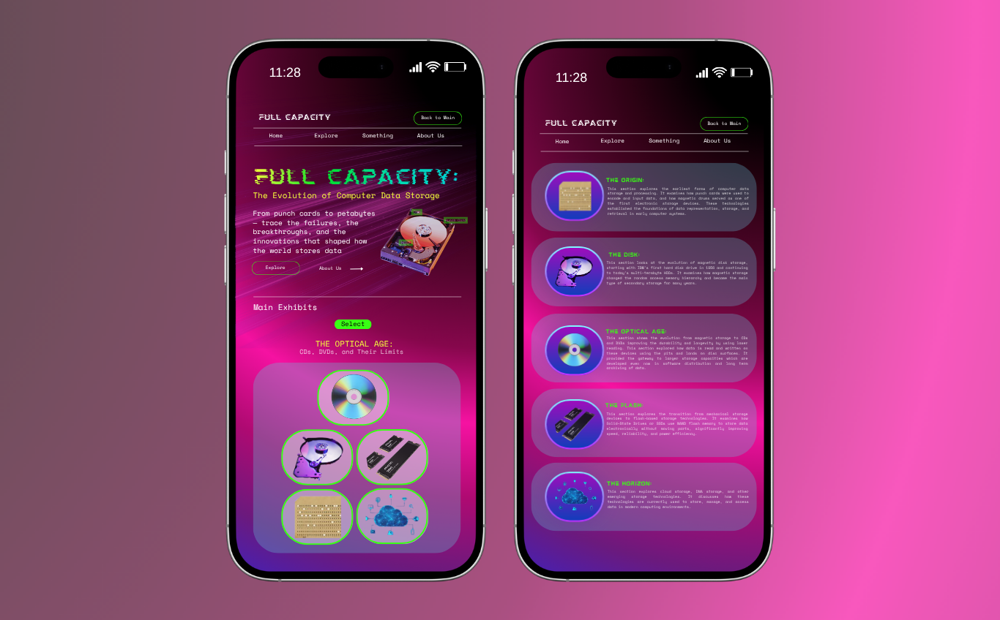

****

**De La Salle University \- Manila**

# **Full Capacity: The Evolution of Computer Data Storage**

In Partial Fulfillment of the   
Course Requirements for

**INTRODUCTION TO COMPUTER ORGANIZATION AND ARCHITECTURE 2 (CSARCH2)**  
3rd Term, A.Y. 2025-2026

***Submitted by Group 7 \[S01\]:***

* GALICIA, Lance Krystofer A.  
* KE, Xan Luo C.  
* MOJICA, Maurienne Marie M.  
* PARADO, Sky Hannah G.  
* YAMSUAN, Rhian Claire V.

***Submitted to:***  
Roger Luis Uy

***Submitted on:***  
June 06, 2026

**I. VIRTUAL EXHIBIT PLAN**

	This section outlines the conceptual framework of the virtual exhibit. Each chapter is designed to guide visitors through a chronological and technical journey of computer data storage evolution. 

**A. Introduction**

The chosen topic covers the Evolution of Computer Data Storage, specifically how data storage has progressed from primitive mechanical media to the ultra-fast, high-capacity solutions of modern computing. It examines the advancement of storage hardware, from magnetic drums and punch cards to solid-state drives and NVMe, and how each technological leap directly influenced computer architecture, memory hierarchy, and system performance.

It will cover the following situations as chapters in pairs; the problems and the given improvements in storage evolution, as such:

1. The Origin: Punch Cards and Magnetic Drums  
2. The Disk: Magnetic Storage and HDDs  
3. The Optical Age: CDs, DVDs, and Their Limits  
4. The Flash: SSDs, NAND, and NVMe  
5. The Horizon: Cloud, DNA, and Emerging Storage

### **B. Main Exhibit**

* **The Origin: Punch Cards and Magnetic Drums**  
1. Description: This section explores the earliest forms of computer data storage and processing. It examines how punch cards were used to encode and input data, and how magnetic drums served as one of the first electronic storage devices. These technologies established the foundations of data representation, storage, and retrieval in early computer systems.   
2. Key concepts:  
* Punch card data encoding and processing	  
* Batch Processing Systems  
* Magnetic drum memory operations  
* Sequential data access  
* Early computer input and storage methods  
* Foundations of digital data storage

* **The Disk: Magnetic Storage and HDDs**  
1. Description: This section looks at the evolution of magnetic disk storage, starting with IBM's first hard disk drive in 1956 and continuing to today's multi-terabyte HDDs. It examines how magnetic storage changed the random access memory hierarchy and became the main type of secondary storage for many years.  
2. Key Concepts:  
* Magnetic recording principles  
* Platters, read/write heads, and actuator arms  
* Random access vs. sequential access  
* Storage capability scaling and areal density  
* HDD role in memory hierarchy

* **The Optical Age: CDs, DVDs, and Their Limits**  
1. Description: This section shows the evolution from magnetic storage to CDs and DVDs improving the durability and longevity by using laser reading. This section explored how data is read and written on these devices using the pits and lands on disc surfaces. It provided the gateway to larger storage capacities which are developed even now in software distribution and long term archiving of data.  
2. Key concepts:  
* Optical data storage utilizing lasers  
* CD and DVD data encoding and retrieval  
* Pits and Lands as Binary Data Representation  
* Digital Media Distribution and Archival Storage  
* Offline/Tertiary Storage and Reimagination of Storage

* **The Flash: SSDs, NAND, and NVMe**   
1. Description: This section explores the transition from mechanical storage devices to flash-based storage technologies. It examines how Solid-State Drives or SSDs use NAND flash memory to store data electronically without moving parts, significantly improving speed, reliability, and power efficiency. The section also discusses the development of NVMe or Non-Volatile Memory Express, a modern storage interface designed to fully utilize the performance potential of flash memory by communicating directly with the system through high-speed PCIe connections.  
2. Key concepts:  
* NAND Flash Memory Architecture  
* Solid-State Drives (SSDs)  
* Non-Volatile Storage  
* Wear Leveling and Flash Memory Lifespan  
* SATA vs. NVMe Interfaces  
* PCI Express (PCIe) Communication  
* Storage Performance and Latency  
* Input/Output Operations Per Second (IOPS)  
* Modern Memory Hierarchy

* **The Horizon: Cloud, DNA, and Emerging Storage**		  
1. Description: This section explores cloud storage, DNA storage, and other emerging storage technologies. It discusses how these technologies are currently used to store, manage, and access data in modern computing environments.  
2. Key concepts:  
* Cloud Storage Architecture  
* Data Centers  
* Distributed Storage Systems  
* DNA Storage  
* Modern Data Storage Methods  
* Data Access and Retrieval  
* Storage Capacity and Scalability  
* Data Backup and Redundancy  
* Emerging Storage Technologies

### **C. Conclusion**

The overall goal is to understand the design and limitations of each breakthrough. The need for storage for both regular functions and long term memory have shaped the technology that we use today, moreover, it is important to understand which aspect of the technology was carried and dropped and how this shaped our modern storage through both hardware and software. Through the generations, we can observe how memory hierarchy, I/O systems and performance bottlenecks evolve, showing how important computer architecture is in optimizing systems and improving performance and efficiency, not just locally but globally. 

By the end of the exhibit, visitors will be able to explain how storage technologies evolved from early physical media to modern and emerging systems, understand the architectural principles and trade-offs behind each innovation, and recognize how these developments shaped today's storage hierarchy and computer systems.

---

**II. TECHNICAL STACK PLAN**

| Component | Technology | Version | Application & Justification |
| ----- | ----- | ----- | ----- |
| Runtime | Node.js | v26.0.0 | Running Astro and building tools. |
| Framework | Astro | v6.0 | Builds a website with interactive parts. |
| Content | MDX | @astrojs/mdx | Allows Markdown content with diagrams and buttons. |
| UI Components | React | v19.x | Builds interactive elements like dynamic content,  diagrams and pop ups. |
| Styling | Tailwind CSS | v4.x | For ready-made classes for design purposes.. |
| Version Control | GitHub | \- | For easy collaboration and version tracking. |

---

**III. ELEMENT PLAN**

This section describes the interactive components integrated into the exhibit to enhance visitor engagement and reinforce key concepts. Each element is designed to translate abstract technical concepts into hands-on, visual experiences that are accessible to visitors regardless of their technical background.

1. **Text-to-Punch Card Simulator** \- This interactive simulator allows visitors to enter text and see how it would be represented on a punch card. It helps visitors understand how early computers stored and processed data using punched holes as a form of data encoding.

	**Features**

* Text input field for user-entered data  
* Real-time punch card visualization 

### **User Interaction Flow**

* The visitor enters a character into the input field.  
* The simulator immediately punches the corresponding holes on the virtual punch card.  
* As additional characters are entered, new punch patterns are added to the card in real time.  
* The visitor observes how each character is encoded and stored on a punch card.  
* The visitor explores how punch cards were used for data input and storage in early computer systems.

2. **HDD Read/Write Simulator** \- This interactive simulator allows visitors to visualize how data is stored and retrieved in a hard disk drive using platters, tracks, and sectors. It helps visitors understand how mechanical movement and magnetic storage enable random access in HDDs.

**Features**

* Interactive rotating platter animation  
* Click-to-select data sectors on the disk  
* Read/write head movement visualization  
* Highlighted track, sector, and data location display 

### **User Interaction Flow**

* The visitor selects a data block on the virtual disk.  
* The platter rotates to align the correct track under the read/write head.  
* The read/write head moves across the actuator arm to the selected position.  
* The target sector is highlighted to show where data is stored or retrieved.  
* The visitor observes how HDDs locate and access data using mechanical movement. 

3. **Optical Pit and Land Encoder Simulator** \- This interactive simulator allows visitors to convert text into binary and visualize how CDs and DVDs store data using pits (0) and lands (1). It helps users understand how optical media encodes digital information through physical surface patterns.

**Features**

* Text-to-binary conversion display  
* Pit and land visualization on disc tracks  
* Laser reading simulation  
* Highlight of binary-to-physical mapping 

### **User Interaction Flow**

* The visitor enters text into the input field.  
* The simulator converts the text into binary form.  
* Binary values are mapped into pits and lands on a disc track.  
* A laser animation reads the surface pattern.  
* The visitor observes how binary data is physically represented on optical media. 

4. **SSD Speed Challenge** \- This interactive comparison allows visitors to explore how flash-based storage technologies improved data access speeds compared to traditional hard disk drives. By comparing HDDs, SATA SSDs, and NVMe SSDs, visitors learn how advances in storage architecture, NAND flash memory, and PCIe communication reduced latency and increased overall system performance

**Features**

* Storage device selector (HDD, SATA SSD, NVMe SSD)  
* Real-time performance comparison display  
* Interactive visual showing data travel paths from storage to the CPU  
* Key statistics display (latency, speed, and IOPS)  
* Explanations of SATA and NVMe communication methods

### **User Interaction Flow**

* The visitor selects a storage technology from the available options: HDD, SATA SSD, or NVMe SSD.  
* The exhibit displays a visual representation of how data travels from the storage device to the processor.  
* Performance metrics such as access speed, latency, and IOPS are displayed and updated based on the selected technology.  
* The visitor switches between storage technologies to compare their performance characteristics.  
* The exhibit highlights how NAND flash memory eliminates mechanical delays and how NVMe utilizes PCIe connections to achieve higher speeds than SATA-based storage.  
* The visitor gains an understanding of why SSDs and NVMe drives became the preferred storage solutions in modern computer systems.

5. **Data Storage Destination Simulator** \- This interactive simulator allows visitors to choose different types of data and see where they would be stored using modern storage technologies. It helps visitors understand the differences between local storage, cloud storage, distributed systems, and emerging technologies such as DNA storage.

**Features**

* Selectable data types (photos, videos, documents, backups, archives)  
* Interactive storage technology cards  
* Explanation of storage location, scalability, and accessibility

### **User Interaction Flow**

* The visitor selects a type of data from a list.  
* The simulator displays several storage options such as SSD, cloud storage, distributed storage, and DNA storage.  
* The visitor selects a storage technology.  
* The simulator explains how the selected technology stores the data and highlights its advantages and limitations.  
* The visitor compares different storage methods and learns why certain technologies are better suited for specific use cases.

### **Mobile Responsiveness**

All interactive components are designed to be fully responsive and optimized for mobile devices. Layouts automatically adjust to vertical stacking for smaller screens, ensuring readability and usability. Touch-based interactions replace hover and click-based controls, with simplified animations to maintain smooth performance. Visual elements such as diagrams, simulations, and comparison panels are scaled appropriately to fit different screen sizes without losing clarity or functionality. Interactive buttons, input fields, and selection controls are sized for touch navigation, allowing visitors to easily engage with exhibit content on phones and tablets.

---

# **IV. TENTATIVE STYLE GUIDE SNAPSHOT**

This section presents the preliminary visual and design direction for the virtual exhibit. The specifications outlined below serve as a reference for maintaining consistency in aesthetics, typography, and layout throughout the development process.

**Table 1\.** Tentative Style Guide for “Full Capacity” Virtual Exhibit

| Theme | Cyberpunk Archive |
| :---- | :---- |
| **Color Palette** |  |
| **Typography** | Heading Font: Mokoto Glitch  (Desktop) Body Font: Space Mono |
| **Layout** | Describe: Landing page The landing page introduces the title of the project, “Full Capacity: The Evolution of Computer Data Storage.” It features a prominent section with visuals of storage devices and a brief overview of the exhibit. Navigation The navigation bar provides access to the main sections: Home, Explore, and About Us, allowing users to move between different parts of the website easily. Content sections The content is organized into exhibit sections showcasing different storage technologies, such as punch cards, hard disk drives (HDDs), optical media (CDs/DVDs), RAM, and cloud storage, with accompanying descriptions and visuals. Interactive area Users can interact with storage device icons or cards by selecting them to activate the interactive components implemented. Footer The footer serves as the closing section of the page and can contain additional navigation links, exhibit information, credits, and other supporting details for users. |
| **Accessibility Considerations** | Contrast The design uses high contrast between bright text/elements and the dark pink-purple background, making key content and buttons stand out. Responsive Design The project includes both desktop and mobile layouts, with content and interactive elements rearranged to fit smaller screens while maintaining functionality and visual consistency. Keyboard Navigation Navigation and interactive elements such as buttons and selectable exhibit cards should be accessible through keyboard controls, allowing users to navigate without a mouse. Alt Text Images of storage devices and exhibit visuals include descriptive alt text to help screen reader users understand the content and purpose of each image. |

**APPENDICES**

****

**Figure 1\.** Desktop Layout Mockup of the "Full Capacity" Virtual Exhibit Landing Page

**Figure 2\.** Mobile Layout Mockup of the "Full Capacity" Virtual Exhibit Landing Page